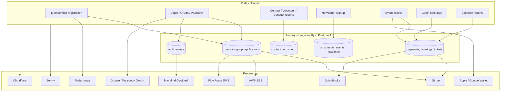

# GDPR Data Audit — Young Scandinavians Club (YSC)

**Audit date:** July 15, 2026  
**Scope:** ysc.org web application (`ysc-redesign-ex`)  
**Status:** Living document — update when data flows or vendors change

This audit maps personal data collected through the website, third-party processors, and recommended minimization steps. It supports the public [Privacy Policy](/privacy-policy) and ongoing compliance work (manual DSAR handling, retention policies, DPAs).

---

## 1. Executive summary

YSC collects substantial personal data to operate membership, events, cabin bookings, payments, and communications. Data is stored primarily in PostgreSQL on Fly.io (United States). Payment card data is handled by Stripe; YSC stores only payment method metadata (last four digits, brand, expiry).

**Strengths today**

- No ad/marketing analytics (no Google Analytics, Meta Pixel, etc.)
- SMS used transactionally with explicit opt-in
- Sensitive fields encrypted at rest (bank accounts, OAuth refresh tokens)
- Sentry scrubber removes tokens/passwords from error reports
- Newsletter unsubscribe and SES click tracking are first-party controlled

**Gaps to address (priority order)**

| Priority | Gap | Recommended action |
|----------|-----|-------------------|
| High | Privacy policy under-disclosed third parties | ✅ Addressed in privacy policy update (July 2026) |
| High | No documented retention schedule | Define retention per data category; implement automated purge where feasible |
| Medium | `auth_events` stores IP + geo indefinitely | Set retention window (e.g. 12–24 months); anonymize older rows |
| Medium | `message_idempotency_entries` stores full rendered messages | Short TTL or redact body after delivery |
| Medium | No cookie consent banner for non-essential cookies | Evaluate Cloudflare Web Analytics; add consent if required for EU visitors |
| Low | Debug logs may include guest names in booking checkout | Ensure prod log level stays `:info`; audit `inspect()` in hot paths |
| Low | Admin user CSV export has no audit trail beyond Oban job | Log export events with admin ID and field list |

---

## 2. Data flow map

---

## 3. Personal data inventory

### 3.1 Account & identity

| Data | Source | Stored in | Purpose | Lawful basis (GDPR) |
|------|--------|-----------|---------|---------------------|
| Email, name, phone, DOB | Registration, settings | `users` | Account, communications | Contract / legitimate interest |
| Password hash | Account setup | `users` | Authentication | Contract |
| Mailing address | Registration, settings | `addresses`, `signup_applications` | Membership eligibility, billing | Contract |
| Heritage / eligibility answers | Registration | `signup_applications`, `family_members` | Bylaws compliance | Contract / legal obligation |
| Profile photo | Upload or OAuth | `avatars`, S3 | Member profile | Consent / contract |
| Passkey credentials | User settings | `user_passkeys` | Passwordless login | Contract |
| Stripe customer ID | Account setup | `users` | Billing | Contract |
| QuickBooks customer ID | Subscription sync | `users` | Accounting | Legitimate interest |

**Key modules:** `lib/ysc/accounts/user.ex`, `lib/ysc_web/live/user_registration_live.ex`, `lib/ysc_web/live/account_setup_live.ex`

### 3.2 Authentication & security

| Data | Source | Stored in | Purpose | Lawful basis |
|------|--------|-----------|---------|--------------|
| Session token | Login | `users_tokens`, cookie `_ysc_key` | Stay logged in | Contract |
| Remember-me token | Login checkbox | Cookie `_ysc_web_user_remember_me` | Persistent session | Consent |
| IP address, user agent, device info | Every login | `auth_events` | Security audit, new-device alerts | Legitimate interest |
| Geo (country, city, lat/lng) | IP lookup (MaxMind local DB) | `auth_events` | New sign-in notifications | Legitimate interest |
| Failed login email | Login attempts | `auth_events` | Security | Legitimate interest |

**Key modules:** `lib/ysc_web/user_auth.ex`, `lib/ysc/accounts/auth_event.ex`, `lib/ysc/geo_ip.ex`

### 3.3 Payments & subscriptions

| Data | Source | Stored in | Purpose | Lawful basis |
|------|--------|-----------|---------|--------------|
| Full card/bank details | Checkout | **Stripe only** | Payment processing | Contract |
| Last 4, brand, expiry | Stripe webhooks | `payment_methods` | Display saved methods | Contract |
| Payment amounts, IDs | Stripe | `payments`, `ticket_orders` | Records, reconciliation | Contract / legal obligation |
| Bank routing + account (encrypted) | Expense reports | `bank_accounts` | Reimbursement ACH | Contract |
| Webhook payloads | Stripe/SMS/etc. | `webhook_events` | Idempotent processing | Legitimate interest |

**Key modules:** `lib/ysc/stripe_client.ex`, `lib/ysc/payments/payment_method.ex`, `lib/ysc/expense_reports/bank_account.ex`

### 3.4 Events & tickets

| Data | Source | Stored in | Purpose | Lawful basis |
|------|--------|-----------|---------|--------------|
| Attendee name/email | Ticket purchase | `ticket_details` | Event registration tiers | Contract |
| Check-in scans | Door staff | `scan_records`, `session_check_ins` | Event entry | Legitimate interest |
| Email open/click | Newsletter-style event emails | `email_events` | Delivery analytics | Legitimate interest / consent |

### 3.5 Cabin bookings

| Data | Source | Stored in | Purpose | Lawful basis |
|------|--------|-----------|---------|--------------|
| Guest names | Checkout | `booking_guests` | Property management | Contract |
| Vehicle make/color | Check-in | `check_in_vehicles` | Property rules | Contract |

### 3.6 Communications

| Data | Source | Stored in | Purpose | Lawful basis |
|------|--------|-----------|---------|--------------|
| Newsletter email, name | Homepage form | `newsletter_subscribers` | Club updates | Consent |
| SMS body, phone numbers | Notifications | `sms_messages`, `sms_received` | Transactional SMS | Consent / contract |
| Rendered email/SMS content | Outbound workers | `message_idempotency_entries` | Dedup, debugging | Legitimate interest |

### 3.7 Public forms (may be submitted without an account)

| Data | Form | Stored in |
|------|------|-----------|
| Name, email, message | Contact | `contact_forms` |
| Name, email, interests | Volunteer | `volunteer_signups` |
| Name, email, phone, summary | Conduct violation | `conduct_violation_reports` |

### 3.8 User-generated content

| Data | Stored in | Notes |
|------|-----------|-------|
| Posts, comments | `posts`, `comments` | May contain personal info in free text |
| Uploaded images | `images`, S3 | Event photos, media library |
| Admin notes about members | `user_notes` | Internal only |

### 3.9 Technical / cookies (browser)

| Cookie / storage | Essential? | Data | Purpose |
|------------------|------------|------|---------|
| `_ysc_key` (session) | Yes | Encrypted session (user token, LiveView ID) | Login state |
| `_ysc_web_user_remember_me` | No (opt-in) | Signed session reference | 60-day remember me |
| `admin-sidebar-collapsed` | No | UI preference | Admin layout only |
| localStorage (admin) | No | UI preferences | No member PII |

---

## 4. Third-party processor audit

| Vendor | Role | Data shared | Location / DPA | GDPR notes |
|--------|------|-------------|----------------|------------|
| **Stripe** | Payments | Name, email, phone, billing address, payment metadata | US; Stripe DPA available | PCI DSS; primary payment processor |
| **Fly.io** | Hosting + Postgres | All application data at rest | US/EU regions (prod: US) | Verify DPA / SCCs for EU members |
| **Tigris (S3)** | Object storage | Avatars, media, expense receipts | Configured via AWS-compatible endpoint | Sub-processor of Fly |
| **AWS SES** | Outbound email | Recipient email, name, message body | AWS region from `SES_AWS_REGION` | AWS DPA; newsletter may use click tracking |
| **FlowRoute** | SMS | Phone number, message body | US telecom | Transactional only; verify DPA |
| **QuickBooks (Intuit)** | Accounting | Customer name, email, phone, transaction details | US | Required for club finances; limit to necessary fields |
| **Sentry** | Error monitoring | User id/email/role on errors; scrubbed request params | US (Sentry.io) | Scrubber in `lib/ysc/sentry_scrubber.ex`; review sampling |
| **Cloudflare** | CDN, Turnstile CAPTCHA, possible Web Analytics | IP, browser signals on challenged forms | Global | Turnstile on contact/newsletter forms |
| **Google** | OAuth login (`email profile`) | Email, profile picture URL | US | Optional login method |
| **Facebook** | OAuth login | Email, name, picture | US | Optional login method |
| **Radar** | Address autocomplete, maps | Address search queries | US (Radar.io) | Used in registration/booking flows |
| **MaxMind** | GeoIP | Weekly CI download to shared S3; IPs looked up locally from that DB | Local processing | No ongoing IP export to MaxMind |
| **Google Wallet / Apple Wallet** | Digital passes | Ticket/membership holder name, event details | Google/Apple | User-initiated pass download |
| **Google Photos** | Admin event albums | OAuth tokens; uploaded photos | Google | Admin-only integration |
| **OpenRouter** | Admin help LLM | Admin questions + public site snippets | Third-party LLM | No intentional member PII in prompts |
| **Discord** | Ops webhooks | Financial alert text (no member PII by default) | Discord | Internal alerts only |

**Not used:** Google Analytics, Plausible, Mixpanel, Mailchimp, SendGrid, ad pixels.

---

## 5. Data minimization recommendations

### Already aligned

- Password and phone deferred until after registration approval path
- Card numbers never touch YSC servers (Stripe Elements)
- Bank account numbers encrypted with `Ysc.Encrypted.Binary`
- Newsletter and SMS require explicit opt-in
- No sale of personal data

### Recommended changes

1. **`auth_events` retention** — Delete or anonymize records older than 24 months; drop precise lat/lng after 90 days if only used for login emails.
2. **`message_idempotency_entries`** — Purge `rendered_message` and `params` after 30 days; keep hash only.
3. **`webhook_events.payload`** — Truncate or purge after successful processing (30–90 days).
4. **Ticket attendee data** — Delete `ticket_details` for past events after N years unless needed for disputes.
5. **Newsletter subscribers** — Hard-delete on unsubscribe after suppression period (e.g. 30 days).
6. **Conduct reports** — Document retention with board; anonymize after case closure where possible.
7. **Signup applications for rejected applicants** — Define purge timeline.
8. **Logging** — Remove or redact `inspect(guest_params)` in `booking_checkout_live.ex` at debug level.
9. **Sentry browser context** — Review whether email is necessary in client-side user context (`docs/sentry-user-context.md`).
10. **Cloudflare Web Analytics** — If enabled at CDN level, disclose in cookie section and consider consent for EU.

---

## 6. Member rights — manual DSAR process

**Policy decision (July 2026):** Data export and deletion requests are fulfilled **manually** when members contact the Board. No self-service export or account-deletion UI is required.

| Right | How members exercise it | How the Board fulfills it |
|-------|-------------------------|---------------------------|
| **Access** | Email `info@ysc.org` (subject "Privacy Request") | Compile data from admin user detail, payments, bookings, tickets; use admin CSV export (`UserExporter`) where helpful |
| **Rectification** | Account settings at ysc.org, or email if they need help | Member self-service; admin edits in admin user detail if needed |
| **Erasure** | Email `info@ysc.org` (subject "Privacy Request") | Manual review: delete/anonymize account data; retain financial/tax records per legal obligation |
| **Restrict processing** | Email or account notification prefs | Toggle SMS/email prefs; document any formal restriction in admin notes |
| **Portability** | Email `info@ysc.org` | Provide export (e.g. CSV/JSON) assembled manually or via `UserExporter` |
| **Object** | Newsletter unsubscribe; SMS STOP; or email | Honor opt-outs; evaluate legitimate-interest objections case by case |
| **Withdraw consent** | Unsubscribe links, SMS STOP, account settings | Same as above |

**DSAR contact:** `info@ysc.org` with subject **"Privacy Request"** (stated in the privacy policy). Target response: **30 days**.

### Manual request checklist (for Board / admins)

1. **Verify identity** — Confirm the requester controls the account (reply from registered email, or reasonable alternate proof).
2. **Clarify scope** — Access/export, correction, deletion, or restriction.
3. **Access / portability** — Gather from: `users`, `signup_applications`, `addresses`, `bookings`, `tickets`, `payments`, `newsletter_subscribers` (if applicable). Admin → Users → export can supplement. Redact other members' data from exports.
4. **Deletion** — After confirming no blocking legal hold (open disputes, required tax records):
   - Cancel Stripe subscription / customer as appropriate
   - Anonymize or delete user row and related PII tables where policy allows
   - Keep anonymized payment/ledger entries if required for accounting
   - Remove from newsletter list; revoke session tokens
5. **Document** — Brief note in `user_notes` or board records: date, request type, actions taken.
6. **Respond** — Confirm completion to the member by email.

---

## 7. International transfers

- Primary hosting and database: **United States** (Fly.io).
- EU/EEA/UK members may have data transferred to the US via subprocessors listed above.
- Rely on vendor DPAs and Standard Contractual Clauses where applicable.
- Consider stating this explicitly in the privacy policy (done in July 2026 update).

---

## 8. Related documents & code

| Document / area | Path |
|-----------------|------|
| Public privacy policy | `lib/ysc_web/controllers/page_html/privacy_policy.html.heex` |
| Terms of service | `lib/ysc_web/controllers/page_html/terms_of_service.html.heex` |
| Sentry scrubbing | `lib/ysc/sentry_scrubber.ex` |
| Session cookies | `lib/ysc_web/endpoint.ex`, `lib/ysc_web/user_auth.ex` |
| Security headers / CSP | `lib/ysc_web/plugs/security_headers.ex` |
| Admin user export | `lib/ysc_web/workers/user_exporter.ex` |

---

## 9. Next compliance steps (beyond this audit)

1. ✅ Update privacy policy (July 2026)
2. ✅ Manual DSAR via email (`info@ysc.org`) — no self-service tooling required
3. Board approval of retention schedule
4. Execute/verify DPAs with Stripe, Fly, AWS, FlowRoute, Intuit, Sentry, Cloudflare
5. Cookie/consent banner if non-essential tracking is confirmed active
6. Record of Processing Activities (ROPA) for board records
7. Data Protection Impact Assessment (DPIA) if high-risk processing expands (e.g. biometric, large-scale profiling)

---

*Maintainers: update this document when adding vendors, new forms, or new tables that store personal data.*
